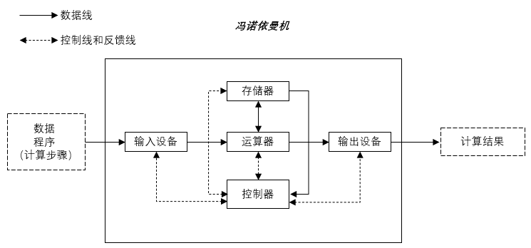
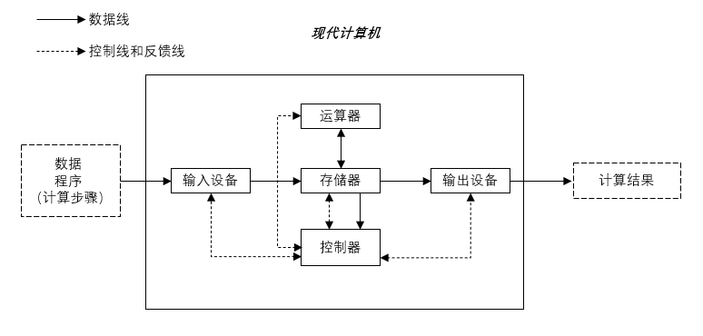
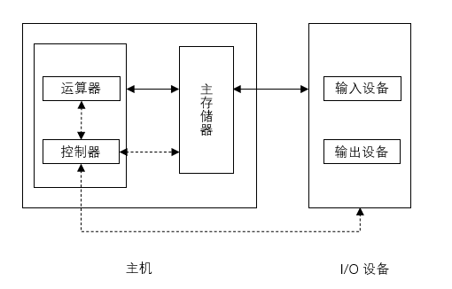
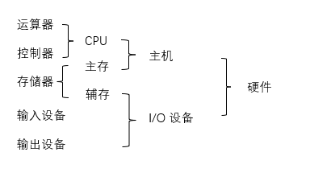

## 计算机硬件的基本组成

### 一、早期冯诺依曼机

#### 1.1 结构

**存储程序**：将指令以二进制代码的形式事先输入计算机的主存储器，然后按其在存储器中的首地址执行程序的第一条指令，以后就按该程序的规定顺序执行其它指令，直至程序执行结束

- `输入设备`：将信息转换成机器能识别的形式

- `存储器`：存放数据和程序

- `运算器`：进行算术运算和逻辑运算
- `控制器`：指挥程序运行
- `输出设备`：将结果转换成人们熟悉的形式

> 在计算机系统中，软件和硬件在逻辑上是等效的
>
> 例如：对于乘法运算，可以设计一个专门的硬件电路实现，也可以用软件的方式执行多次加法运算来实现

#### 1.2 特点

- 计算机由五大部件组成

- 以`运算器`为中心：输入/输出设备与存储器之间的数据传送通过运算器完成

- 存储程序

- 指令和数据以同等地位存于存储器，可按地址寻访

- 指令和数据用二进制表示

- 指令由`操作码`和`地址码`组成

  

  

### 二、现代计算机

以`存储器`为中心

#### 2.1 结构

