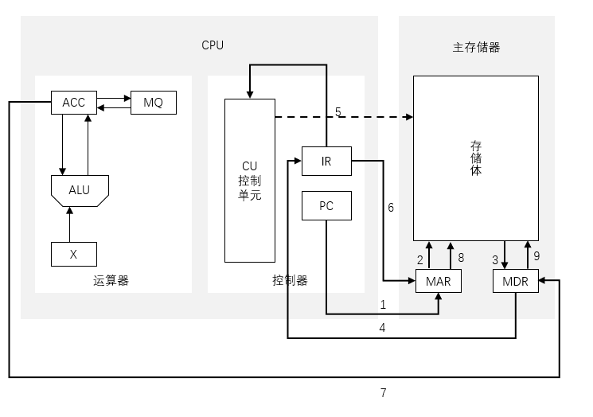

## 各个硬件的工作原理

### 一、各硬件的基本组成

#### 1.1 主存储器的基本组成


##### 1.1.1 存储体

数据在存储体内按地址存储存储单元


`存储单元`：每个存储单元存放一串二进制代码

> 每个地址对应一个存储单元

`存储字`（word）：存储单元中二进制代码的组合

`存储字长`：存储单元中二进制代码的位数

> 存储字长通常为 8 的整数倍

`存储元`：存储二进制的电子元件，每个存储可存 1bit


##### 1.1.2 MAR

Memory Address Register，存储地址寄存器

用于指明要读/写哪个存储单元

MAR 位数反应存储单元的个数

例如：MAR = 4 位 -> 总共由 2^4 个存储单元


##### 1.1.3 MDR

Memory Data Register，存储数据寄存器

用于暂存要读/写的数据

MDR 位数 = 存储字长 = 每个存储单元的大小

例如：MDR = 16 位 -> 每个存储单元可存放 16 bit，此时 1个字（word）= 16 bit


`注意：现在的计算机通常把 MAR、MDR 也集成在 CPU 内`


#### 1.2 运算器的基本组成


用于实现算术运算（如：加减乘除）、逻辑运算（如：与或非）

##### 1.2.1 ACC

Accumulator，累加器

用于存放操作数，或运算结果


##### 1.2.2 MQ

Multiple-Quotient Register，乘商寄存器

在乘、除运算时，用于存放操作数或运算结果


##### 1.2.3 X

通用的操作数寄存器

用于存放操作数


##### 1.2.3 ALU

Arithmetic and Logic Unit，算术逻辑单元

通过内部复杂的电路实现算术运算、逻辑运算


| 寄存器 | 加         | 减         | 乘             | 除           |
| ------ | ---------- | ---------- | -------------- | ------------ |
| ACC    | 被加数、和 | 被减数、差 | 乘积高位       | 被除数、余数 |
| MQ     |            |            | 乘数、乘积低位 | 商           |
| X      | 加数       | 减数       | 被乘数         | 除数         |


#### 1.3 控制器的基本组成


##### 1.3.1 CU

Control Unit，控制单元

分析指令，给出控制信号


##### 1.3.2 IR

Instruction Register，指令寄存器

存放当前执行的指令


##### 1.3.3 PC

Program Counter，程序计数器

存放下一条指令地址，有自动加 1 功能


> 完成一条指令包括 取指令、分析指令和执行指令


### 二、计算机的工作过程

#### 2.1 高级语言编写程序

```c
int a = 2,b = 3,c = 1,y = 0;
void main(){
    y = a * b + c;
}
```


#### 2.2 编译后装入主存


#### 2.3 执行取数指令


> #0：(PC) = 0，指向第一条指令的地址
>
> 
>
> #1：(PC) -> MAR，导致 (MAR) = 0
>
> #2 和 #3：M(MAR) -> MDR，导致 (MDR) = 000001 0000000101	
>
> #4：(MDR) -> IR，导致 (IR) = 000001 0000000101
>
> #1 ~ #4：取指令
>
> 
>
> #5：OP(IR) -> CU，指令的操作码送到 CU，CU 分析后得知，这是 "取数" 指令
>
> #5：分析指令
>
> 
>
> #6：Ad(IR) -> MAR，指令的地址码送到 MAR，导致 (MAR) = 5
>
> #7 和 #8：M(MAR) -> MDR，导致 (MDR) = 0000000000000010 = 2
>
> #9：(MDR) -> ACC，导致 (ACC) = 0000000000000010 = 2
>
> #6 ~ #9：执行取数指令


#### 2.4 执行乘法指令


> 上一条指令取指后 PC 自动 + 1，(PC) = 1
>
> 
>
> #1：(PC) -> MAR，导致 (MAR) = 1
>
> #2 和 #3：M(MAR) -> MDR，导致 (MDR) = 000100 0000000110	
>
> #4：(MDR) -> IR，导致 (IR) = 000100 0000000110	
>
> #1 ~ #4：取指令
>
> 
>
> #5：OP(IR) -> CU，指令的操作码送到 CU，CU 分析后得知，这是 "乘法" 指令
>
> #5：分析指令
>
> 
>
> #6：Ad(IR) -> MAR，指令的地址码送到 MAR，导致 (MAR) = 6
>
> #7 和 #8：M(MAR) -> MDR，导致 (MDR) = 0000000000000011 = 3
>
> #9：(MDR) -> MQ，导致 (MQ) = 0000000000000011 = 3
>
> #10：(ACC) -> X，导致 (X) = 2
>
> #11：(MQ) * (X) -> ACC，由 ALU 实现乘法运算，导致（ACC）= 6，如果乘积太大，则需要 MQ 辅助存储
>
> #6 ~ #11：执行乘法指令


#### 2.5 执行加法指令


> 上一条指令取指后 PC 自动 + 1，(PC) = 2
>
> 
>
> #1：(PC) -> MAR，导致 (MAR) = 2
>
> #2 和 #3：M(MAR) -> MDR，导致 (MDR) = 000010 0000000111	
>
> #4：(MDR) -> IR，导致 (IR) = 000011 0000000111	
>
> #1 ~ #4：取指令
>
> 
>
> #5：OP(IR) -> CU，指令的操作码送到 CU，CU 分析后得知，这是 "加法" 指令
>
> #5：分析指令
>
> 
>
> #6：Ad(IR) -> MAR，指令的地址码送到 MAR，导致 (MAR) = 7
>
> #7 和 #8：M(MAR) -> MDR，导致 (MDR) = 0000000000000001 = 1
>
> #9：(MDR) -> X，导致 (X) = 0000000000000001 = 1
>
> #10：(ACC) + (X) -> ACC，由 ALU 实现加法运算，导致（ACC）= 6
>
> #6 ~ #10：执行加法指令


#### 2.6 执行存数指令




> 上一条指令取指后 PC 自动 + 1，(PC) = 3
>
> 
>
> #1：(PC) -> MAR，导致 (MAR) = 3
>
> #2 和 #3：M(MAR) -> MDR，导致 (MDR) = 000100 0000001000	
>
> #4：(MDR) -> IR，导致 (IR) = 000100 0000001000	
>
> #1 ~ #4：取指令
>
> 
>
> #5：OP(IR) -> CU，指令的操作码送到 CU，CU 分析后得知，这是 "存数" 指令
>
> #5：分析指令
>
> 
>
> #6：Ad(IR) -> MAR，指令的地址码送到 MAR，导致 (MAR) = 8
>
> #7：(ACC) -> MDR，导致 (MDR) = 7
>
> #8 和 #9：(MDR) -> 地址为 (MAR) 的存储单元，导致 y=7
>
> #6 ~ #9：执行存数指令


#### 2.7 执行停机指令


>上一条指令取指后 PC 自动 + 1，(PC) = 4
>
>
>
>#1：(PC) -> MAR，导致 (MAR) = 4
>
>#2 和 #3：M(MAR) -> MDR，导致 (MDR) = 000110 0000000000	
>
>#4：(MDR) -> IR，导致 (IR) = 000110 0000000000		
>
>#1 ~ #4：取指令
>
>
>
>#5：OP(IR) -> CU，指令的操作码送到 CU，CU 分析后得知，这是 "停机" 指令
>
>#5：分析指令
>
>
>
>利用中断机制通知操作系统终止该进程


备注：

- M：主存中某存储单元
- ACC、MQ、X、MAR、MDR...：相应寄存器
- M(MAR)：取存储单元中的数据
- (ACC)...：取相应寄存器中的数据
- 指令：操作码 + 地址码
- OP(IR)：取操作码
- Ad(IR)：取地址码


CPU 区分指令和数据的依据：`指令周期的不同阶段`


