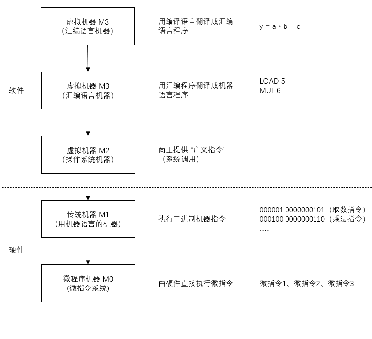

##  计算机系统的多级层次结构

### 一、计算机系统的层次结构

> 下层是上层的基础，上层是下层的扩展

### 二、三种级别的语言

- 编译程序
  - 将高级语言编写的源程序`全部语句`一次全部翻译成机器语言程序，再执行机器语言程序（只需翻译一次）

- 汇编程序
  - 将汇编语言翻译成机器语言

- 解释程序
  - 将源程序的`一条语句`翻译成对应机器语言的语句，并立即执行。然后再翻译下一句（每次执行都要翻译）

注：编译、汇编、解释程序，可统称为 "翻译程序"

### 三、计算机体系结构 VS 计算机组成原理

#### 3.1 计算机体系机构

机器语言程序员所见到的计算机系统的属性概念性的结构与功能特性

（指令系统、数据类型、寻址技术、I/O 机理）

`如何设计硬件与软件之间的接口`，例如：有无乘法指令

#### 3.2 计算机组成原理

实现计算机体系结构所体现的属性，对程序员 "透明"

（具体指令的实现）

`如何用硬件实现所定义的接口`，例如：如何实现乘法指令

