## 进位计数制

### 一、最古老的计数方法

#### 1.1 罗马数字

符号反应权重

| 基本字符         | I    | V    | X    | L    | C    | D    | M    |
| ---------------- | ---- | ---- | ---- | ---- | ---- | ---- | ---- |
| 相应的阿拉伯数字 | 1    | 5    | 10   | 50   | 100  | 500  | 1000 |

#### 1.2 基于 "`加法`" 思想的计数方法

I-1、II-2、III-3、IIII-4(IV)、V-5、X-10、XI-11、XII-12、XIII-13、MDCLXVI-1666、MDCCCLXXXVIII-1888

### 二、十进制计数法

#### 1.1 阿拉伯数字

符号反应权重：0，1，2，3，4，5，6，7，8，9

#### 1.2 十进制

符号所在的位置也反应权重——`位权`

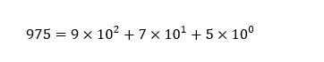

基于 "`乘法`" 思想的计数方法

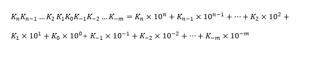

"`逢十进一`"

### 三、r 进制计数法

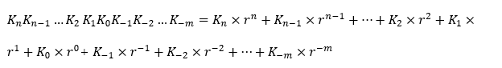

#### 3.1 基数

每个数码位所有可能用到的不同符号的个数，r 进制的基数为 r

> 二进制：0，1
>
> 八进制：0，1，2，3，4，5，6，7
>
> 十进制：0，1，2，3，4，5，6，7，8，9
>
> 十六进制：0，1，2，3，4，5，6，7，8，9，A，B，C，D，E，F

`二进制`是最适合计算机存储和处理的一种方式

- 可使用两个稳定状态的物理器件表示
- 0，1正好对应逻辑值假、真，方便实现逻辑运算
- 可很方便的实用逻辑门电路实现算术运算

### 四、任意进制转十进制

#### 4.1 二进制转十进制

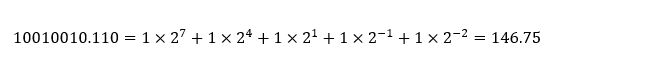

#### 4.2 八进制转十进制

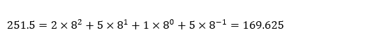

#### 4.3 十六进制转十进制

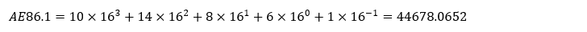

### 五、二进制与八进制、十六进制的相互转换

注意 "`补位`"

#### 5.1 二进制转八进制

3 位一组，每组转换成对应的八进制符号

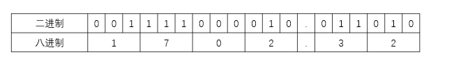

#### 5.2 二进制转十六进制

4 位一组，每组转换成对应的十六进制符号

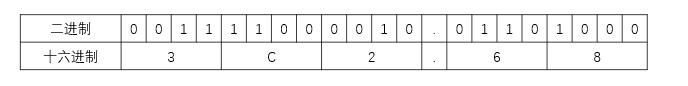

#### 5.3 八进制转二进制

1 位八进制对应 3 位二进制

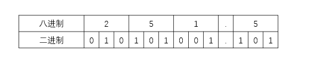

#### 5.4 十六进制转二进制

1 位十六进制对应 4 位二进制

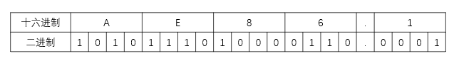

### 六、各种进制的常见书写方式

- 二进制
  - 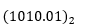
  - 1010.01B

- 八进制
  - 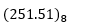

- 十六进制
  - 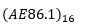
  - AE86.1H
  - 0xAE86.1

- 十进制
  - 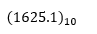
  - 1625.1D

### 七、十进制转任意进制

#### 7.1 十进制转二进制

##### 7.1.1 整数部分

`除基取余法`

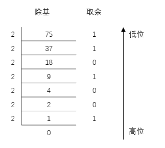

所以

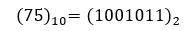

`原理`：

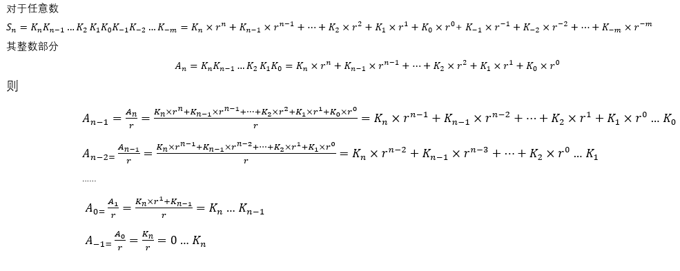

##### 7.1.2 小数部分

`乘基取整法`

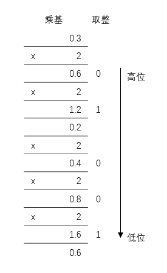

所以

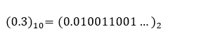

`原理`：

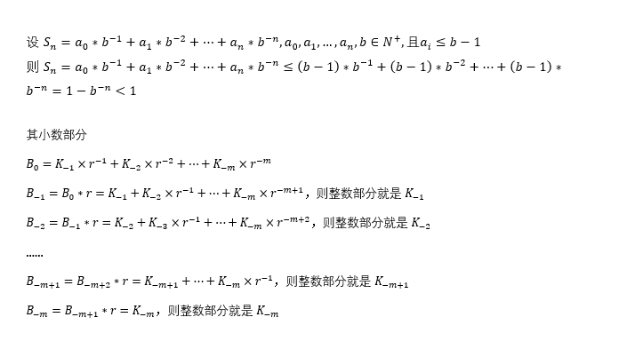

注意：`有的十进制小数无法用二进制精确表示`，如：0.3D

##### 7.1.3 拼凑法

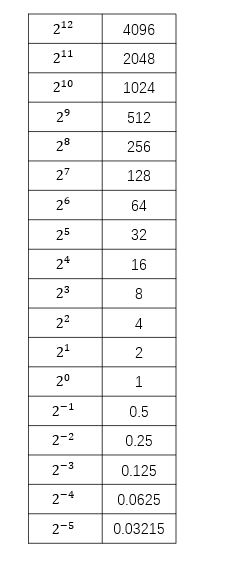

#### 7.2 十进制转八进制和十六进制

先转换成二进制，再转换成八进制或十六进制

### 八、真值和机器数

#### 8.1 真值

符合人类习惯的数字

15、8

#### 8.2 机器数

数字实际存到机器里的形式，`正负号需要被 "数字化"`

+15 -> 0 1111

-8    -> 1 1000 

