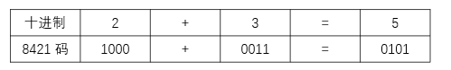
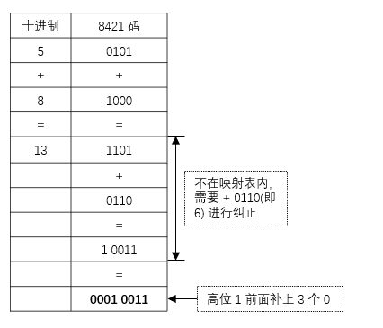
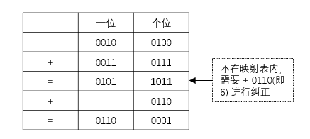

## BCD 码

BCD：Binary-Coded Decimal，`用二进制编码的十进制`

直接使用二进制转换成十进制较为麻烦，可以将十进制的每一位`映射`成一组二进制位

十进制的基数为 10，每个数码位可能用到的符号分别为 0，1，2，3，4，5，6，7，8，9

可用 4 个 bit 来表示每个符号，有 6 个冗余状态

### 一、8421 码

`有权码：8、4、2、1 分别对应每一位的权值`

#### 1.1 映射关系

| 0    | 1    | 2    | 3    | 4    | 5    | 6    | 7    | 8    | 9    |
| ---- | ---- | ---- | ---- | ---- | ---- | ---- | ---- | ---- | ---- |
| 0000 | 0001 | 0010 | 0011 | 0100 | 0101 | 0110 | 0111 | 1000 | 1001 |

例如：十进制数 723 利用 8421 码可表示为 0111 0010 0011

#### 1.2 加法运算

##### 1.2.1 没有超出映射范围

##### 1.2.2 超出映射范围

进行加法后若超出该范围，则需要 + `0110` 进行修正（强制向高位进 1）

> 13 不在映射表内，则 13 + 6 = 19，19 - 16 = 3，即可将个位得出，补上高位的 1，即可得出 13 对应的 8421 码

例子：计算 24 + 37 的 8421 码

结果为 0110 0001

### 二、余 3 码

8421 码 + 0011B 可得出余 3 码

`无权码：每个二进制位没有固定的权值`

| 0    | 1    | 2    | 3    | 4    | 5    | 6    | 7    | 8    | 9    |
| ---- | ---- | ---- | ---- | ---- | ---- | ---- | ---- | ---- | ---- |
| 0011 | 0100 | 0101 | 0110 | 0111 | 1000 | 1001 | 1010 | 1011 | 1100 |

### 三、2421 码

`有权码：2、4、2、1 分别对应每一位的权值`

为避免歧义，0 ~ 4 的最高位是0，5 ~ 9 的最高位是 1

| 0    | 1    | 2    | 3    | 4    | 5    | 6    | 7    | 8    | 9    |
| ---- | ---- | ---- | ---- | ---- | ---- | ---- | ---- | ---- | ---- |
| 0000 | 0001 | 0010 | 0011 | 0100 | 1011 | 1100 | 1101 | 1110 | 1111 |

