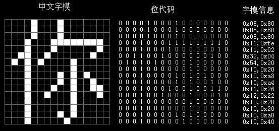
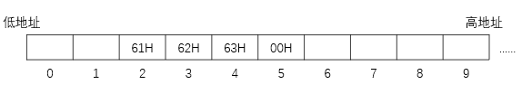
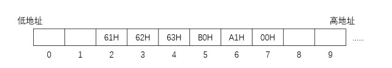
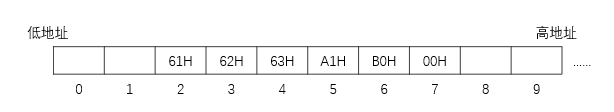

## 字符与字符串

### 一、英文字符在计算机内的表示 

#### 1.1 ASCII 码

英文数字、字母和符号总共有 128 个字符，需要使用 7 位二进制编码

为了存入计算机，通常在`最高位补 0`，凑足 1 B

ASCII 码 32 ~ 126 所对应的字符为可印刷字符，其余为控制字符或通信字符

|      |      |      |      |      |      |      |      |      |      |      |      |      |      |      |      |
| :--: | :--: | :--: | :--: | :--: | :--: | :--: | :--: | :--: | :--: | :--: | :--: | :--: | :--: | :--: | :--: |
|  0   | NUL  |  16  | DLE  |  32  | SPC  |  48  |  0   |  64  |      |  80  |  P   |  96  |      | 112  |  p   |
|  1   | SOH  |  17  | DC1  |  33  |  !   |  49  |  1   |  65  |  A   |  81  |  Q   |  97  |  a   | 113  |  q   |
|  2   | STX  |  18  | DC2  |  34  |  "   |  50  |  2   |  66  |  B   |  82  |  R   |  98  |  b   | 114  |  r   |
|  3   | ETX  |  19  | DC3  |  35  |  #   |  51  |  3   |  67  |  C   |  83  |  S   |  99  |  c   | 115  |  s   |
|  4   | EOT  |  20  | DC4  |  36  |  $   |  52  |  4   |  68  |  D   |  84  |  T   | 100  |  d   | 116  |  t   |
|  5   | ENQ  |  21  | NAK  |  37  |  %   |  53  |  5   |  69  |  E   |  85  |  U   | 101  |  e   | 117  |  u   |
|  6   | ACK  |  22  | SYN  |  38  |  &   |  54  |  6   |  70  |  F   |  86  |  V   | 102  |  f   | 118  |  v   |
|  7   | BEL  |  23  | ETB  |  39  |  '   |  55  |  7   |  71  |  G   |  87  |  W   | 103  |  g   | 119  |  w   |
|  8   |  BS  |  24  | CAN  |  40  |  (   |  56  |  8   |  72  |  H   |  88  |  X   | 104  |  h   | 120  |  x   |
|  9   |  HT  |  25  |  EM  |  41  |  )   |  57  |  9   |  73  |  I   |  89  |  Y   | 105  |  i   | 121  |  y   |
|  10  |  LF  |  26  | SUB  |  42  |  *   |  58  |  :   |  74  |  J   |  90  |  Z   | 106  |  j   | 122  |  z   |
|  11  |  VT  |  27  | ESC  |  43  |  +   |  59  |  ;   |  75  |  K   |  91  |  [   | 107  |  k   | 123  |  {   |
|  12  |  FF  |  28  |  FS  |  44  |  ,   |  60  |  <   |  76  |  L   |  92  |  \   | 108  |  l   | 124  |  \|  |
|  13  |  CR  |  29  |  GS  |  45  |  -   |  61  |  =   |  77  |  M   |  93  |  ]   | 109  |  m   | 125  |  }   |
|  14  |  SO  |  30  |  RS  |  46  |  .   |  62  |  >   |  78  |  N   |  94  |  ^   | 110  |  n   | 126  |  ~   |
|  15  |  SI  |  31  |  US  |  47  |  /   |  63  |  ?   |  79  |  O   |  95  |  _   | 111  |  o   | 127  | DEL  |

> - 0 ~ 9 的 ASCII 码前 4 位为 `0011`，后 4 位即为该数字的 8421 码
>
> 
>
> - A ~ Z 的 ASCII 码前 3 位为 `010`，后 5 位为该字母在字母顺序表的位置，以 1 开始
>
>   - 例如 G 在字母顺序表 第 7 位，则 ASCII 码为 010 00111B，转换成十进制为 71D
>
>   
>
> - a ~ z 的 ASCII 码前 3 位为 `011`，后 5 位为该字母在字母顺序表的位置，以 1 开始
>
>   - 例如 g 在字母顺序表 第 7 位，则 ASCII 码为 011 00111B，转换成十进制为 103D

> ASCII 码中所有大写字母、所有小写字母、所有数字的编码

### 二、中文字符在计算机内的表示

#### 2.1 GB 2312-80

1980 年所指定的 GB 2312 编码

汉字 + 各种符号共 7445 个

##### 2.1.1 区位码

将 7445 个字符划分成 94 个区（0 ~ 93），每个区划分成 94 个位置（0 ~ 93）

以`(区号，位置号)`唯一标识每个字符，即为区位码

例如 '啊' 所在区为 16，所在位置为 01，则区位码为 (16,01)，十六进制表示为 (10H,01H)

##### 2.1.2 国标码

控制/通信字符的ASCII 码值在 0 ~ 31 之间，区位码的区号或位置号取值也可能在 0 ~ 31 之间，所以在通信的时候可能出现歧义

`将区位码加上 32（十六进制为 20H） 得到国标码`

国标码的区号和位置号取值大于等于 32，就不会与控制/通信字符的 ASCII 码产生冲突

例如 '啊' 的国标码为 (10H + 20H,01H + 20H) = (30H,21H)

> 国标码 = 区位码 + 2020H

##### 2.1.3 汉字内码

又叫 汉字机内码

为了与 ASCII 码进行区分，可`将国标码的区号和位置号的最高位分别置为 1`( +128D 或 + 80H) ，得到汉字内码

例如 '啊' 的汉字内码为 (30H + 80H,21H + 80H) = (B0H,A1H)

> 汉字内码 = 国标码 + 8080H

##### 2.1.4 输入编码

输入汉字的编码，可以通过拼音或五笔

输入法软件将输入编码转换成对应的国标码，然后系统或应用软件将国标码转换成对应的汉字内码存储在计算机中

例如输入 '码' 可能是 ma1

##### 2.1.5 汉字字形码

输出汉字时，汉字的形状对应的编码

### 三、字符串

#### 3.1 存储英文字符串

假设某计算机按字节编码，从地址为 2 的单元开始，存储字符串 "abc"

​	按字节编码即每个地址对应 1B

​	a：0100 0001 = 61H

​	b：0100 0010 = 62H

​	c：0100 0011 = 63H

​	很多语言中，'\0' 作为字符串结尾标志

​	\0：0000 0000 = 00H

#### 3.2 存储中文字符串

假设某计算机按字节编码，从地址为 2 的单元开始，存储字符串 "abc啊"

​	按字节编码即每个地址对应 1B

​	a：0100 0001 = 61H

​	b：0100 0010 = 62H

​	c：0100 0011 = 63H

​	'啊' 的机内码为 B0 A1H 

​	很多语言中，'\0' 作为字符串结尾标志

​	\0：0000 0000 = 00H

> 在所有计算机中，`多字节数据（如汉字）`都被存放在`连续`的字节序列中
>
> 根据数据中个字节的排列顺序不同，可能有 "`大端模式`"、"`小端模式`"

##### 3.2.1 大端模式

将数据的最高有效字节存放在低地址单元中

##### 3.2.2 小端模式

将数据的最高有效字节存放在高地址单元中

