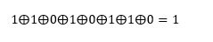

## 奇偶校验码

### 一、校验原理

#### 1.1 码字

由若干位代码组成的一个字

例如：如果只有 A、B、C、D 四个字符，则分别可用 00、01、10、11 来表示，此时 00、01、10、11 就分别称为一个码字

#### 1.2 两个码字间的距离

将两个码字逐位进行对比，具有不同的位的个数称为两个码字间的距离

例如：00 和 01 的距离为 1，000 和 101 的距离为 2

#### 1.3 码距

一个编码方案可能由若干个合法码字，各合法码字间的最小距离称为码距

例如：A、B、C、D 分别用 100、001、010、111 来表示，码字间的最小距离为 2，则该编码方案的码距为 2

> 码距 = 1 时，无检错能力
>
> 码距 = 2 时，有检错能力
>
> 码距 >= 3 时，若设计合理，可能具有检错、纠错能力

### 二、奇偶校验码

在信息为的首部或尾部添加一个奇偶校验位

#### 2.1 概念

奇校验码：整个校验码（有效信息为和校验位）中 "1" 的个数为奇数

偶校验码：整个校验码（有效信息为和校验位）中 "1" 的个数为偶数

例子：各处两个编码 1001101 和 1010111 的奇校验码和偶校验码

| 编码    | 奇校验码 | 偶校验码 |
| ------- | -------- | -------- |
| 1001101 | 11001101 | 01001101 |
| 1010111 | 01010111 | 11010111 |

#### 2.2 偶校验的硬件实现

##### 2.2.1 偶校验位

码字各位进行`异或`（模 2 加）运算，结果即为偶校验位

例如：

1001101 

则 1001101 的偶校验位为 0；

1010111

则 1010111 的偶校验位为 1

##### 2.2.2 进行偶校验

码字的所有位进行`异或`（模 2 加）运算，若结果为 1 说明出错

例如：

01001101

说明 01001101 在传输过程中没有出错；

11010110

说明 11010110 在传输过程中出错，需要重传

`注意`：

- 使用奇偶校验码，当收到的数据 1 的个数奇偶性与原数据不同时，数据一定出错
- 使用奇偶校验码，`当收到的数据 1 的个数奇偶性与原数据相同时，数据不一定正确`
  - 例如：一个使用奇校验码的数据，在传输过程中有 `偶数位` 发生了变化，则收到数据中 1 的个数还是奇数，但数据发生了错误

> 异或运算⨁：两个比特进行异或运算，仅当二者不同时计算结果为 1
>
> 0 ⨁ 0 = 0
>
> 0 ⨁ 1 = 1
>
> 1 ⨁ 0 = 1
>
> 1 ⨁ 1 = 0

